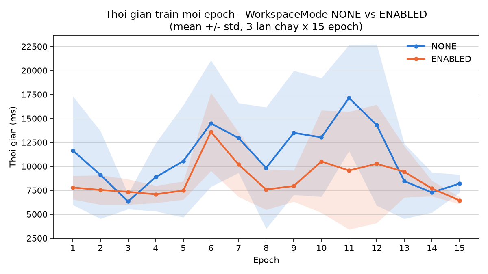
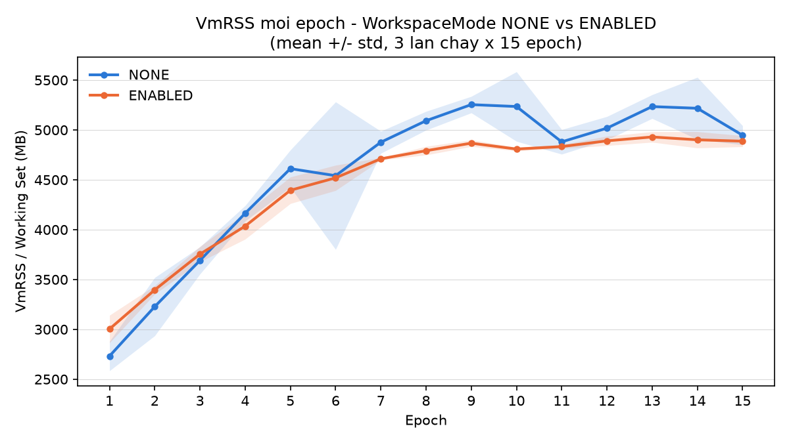
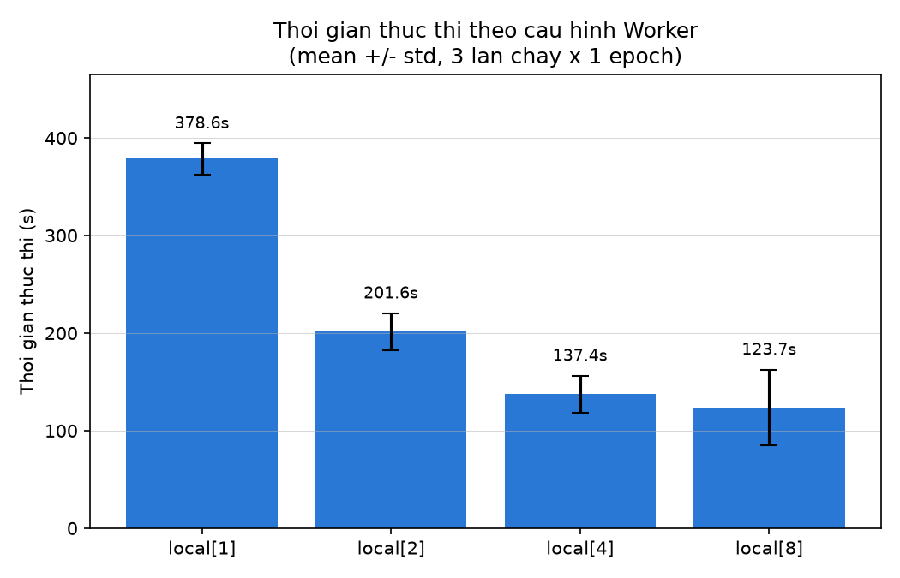
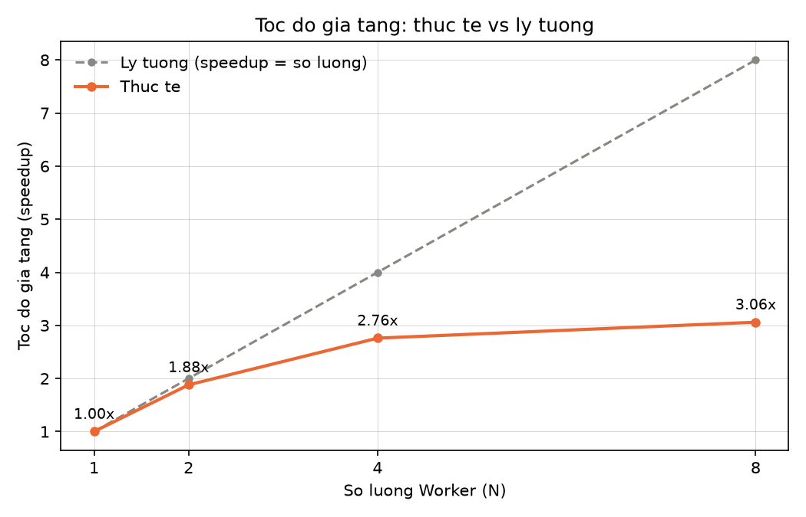
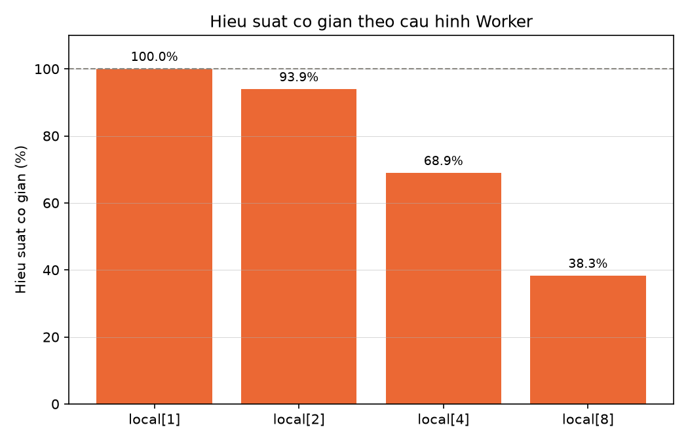
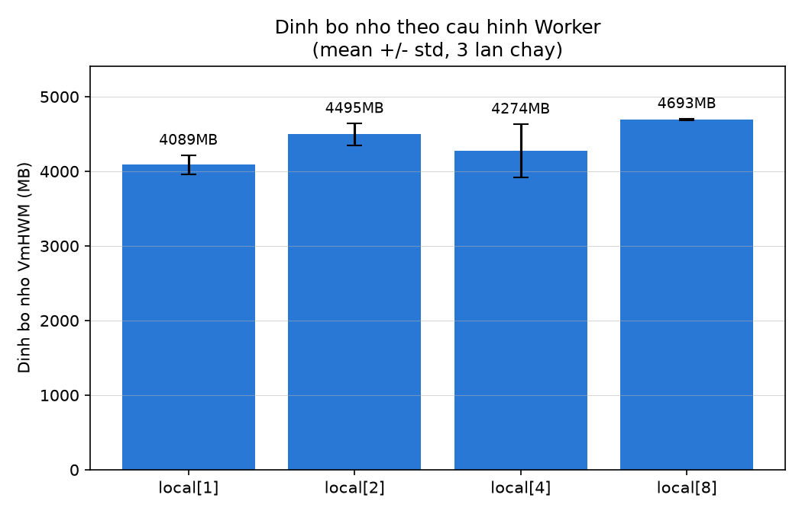
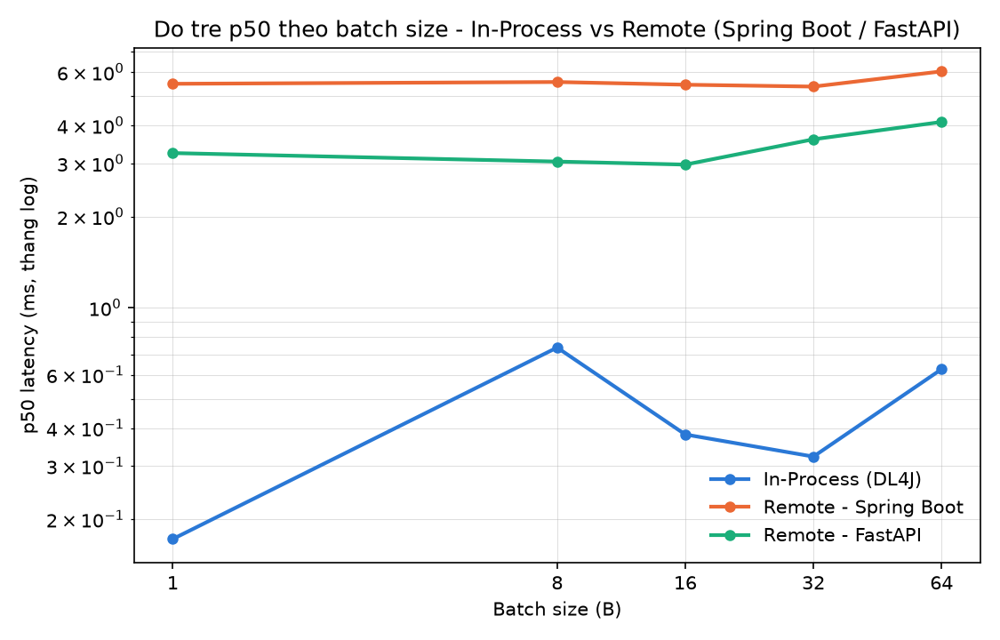
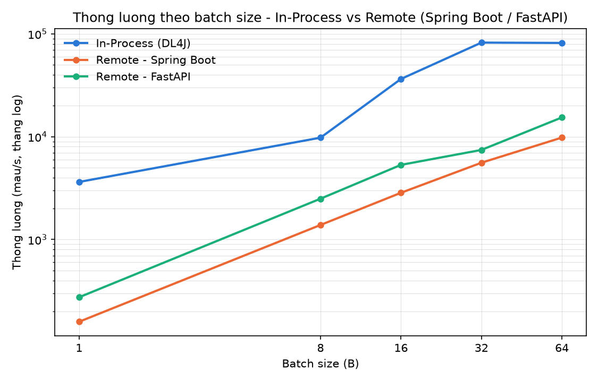

# DL4J CPU Experiment & Fraud Detection Web Demo

Dự án thực nghiệm hiệu năng Deeplearning4j (DL4J) trên CPU thuần (tích hợp Apache Spark),
kèm một web demo trực quan, phục vụ bài thuyết trình về DL4J. Toàn bộ được thiết kế để
chạy hoàn toàn trên **Windows** (không cần WSL2/Linux).

Đặc tả gốc của thực nghiệm nằm ở [`Thiet_Lap_Thuc_Nghiem_DL4J_CPU.md`](Thiet_Lap_Thuc_Nghiem_DL4J_CPU.md).

## Mục lục

- [Tổng quan](#tổng-quan)
- [Kiến trúc & cấu trúc project](#kiến-trúc--cấu-trúc-project)
- [Dataset](#dataset)
- [Yêu cầu môi trường](#yêu-cầu-môi-trường)
- [Cài đặt lần đầu](#cài-đặt-lần-đầu)
- [Chạy từng phần](#chạy-từng-phần)
- [3 kịch bản thực nghiệm](#3-kịch-bản-thực-nghiệm)
- [Web demo](#web-demo)
- [FastAPI comparison service (Python)](#fastapi-comparison-service-python)
- [Kết quả đã đo](#kết-quả-đã-đo)
- [Sự cố đã gặp & cách khắc phục (Windows)](#sự-cố-đã-gặp--cách-khắc-phục-windows)
- [Cấu trúc thư mục](#cấu-trúc-thư-mục)

## Tổng quan

Dự án gồm 2 phần:

1. **Thực nghiệm hiệu năng** — đo và so sánh hành vi của DL4J trên CPU theo 3 kịch bản
   quy định trong đặc tả gốc: `WorkspaceMode`, khả năng mở rộng của Spark local, và độ trễ
   suy luận in-process so với remote (qua REST API).
2. **Web demo** — một ứng dụng Spring Boot vừa serve model (REST API `/predict`) vừa hiển
   thị một trang HTML đơn giản để nhập/dự đoán giao dịch gian lận trực tiếp, cùng biểu đồ
   trực quan hoá kết quả benchmark.

Bài toán được chọn: **phát hiện gian lận thẻ tín dụng** (Kaggle Credit Card Fraud
Detection), dữ liệu dạng bảng (tabular), khớp với `CSVRecordReader` + `NormalizerStandardize`
mà đặc tả gốc yêu cầu.

## Kiến trúc & cấu trúc project

Maven multi-module:

- **`training`** — pipeline dữ liệu (DataVec) + huấn luyện model DL4J (thuần Java và qua
  Spark local). Biên dịch xuống bytecode **Java 11** (xem [lý do](#sự-cố-đã-gặp--cách-khắc-phục-windows)).
- **`benchmark`** — 3 class benchmark tương ứng 3 kịch bản, cộng các tiện ích đo latency/bộ nhớ.
- **`api`** — Spring Boot, serve model qua REST + phục vụ trang web demo tĩnh
  (`api/src/main/resources/static`).

```
D:\deeplearning4j\
├── pom.xml                  # parent POM (version DL4J/Spark/JDK)
├── data\creditcard.csv       # dataset (Kaggle Credit Card Fraud)
├── training\                 # data pipeline + training (Java 11 bytecode)
├── benchmark\                 # 3 kịch bản benchmark
├── api\                       # Spring Boot: REST API + web demo tĩnh
├── pyapi\                     # FastAPI (Python): service đối chứng cho kịch bản 3
├── results\                   # output benchmark (CSV + JSON + report table + charts)
├── logs\                      # log console đầy đủ của từng lần chạy
└── scripts\                   # PowerShell + Python tiện ích
```

## Dataset

`data/creditcard.csv` — Kaggle Credit Card Fraud Detection: 284.807 giao dịch, 30 feature
số (`Time`, `V1`..`V28` đã PCA-transform, `Amount`), nhãn `Class` (0 = bình thường,
1 = gian lận, chỉ ~0.17% dữ liệu là fraud).

## Yêu cầu môi trường

Đã cài và verify hoạt động trên máy này:

| Thành phần | Version | Ghi chú |
| --- | --- | --- |
| JDK 17 | Temurin 17.0.20 | Dùng cho `benchmark`, `api`, và chạy Maven |
| JDK 11 | Temurin 11.0.32 | **Chỉ dùng để chạy `SparkTrainingRunner`** (xem phần sự cố) |
| Apache Maven | 3.9.16 | Cài thủ công tại `C:\devtools\apache-maven-3.9.16` (không có trên winget) |
| Hadoop winutils | 3.3.6 | Tại `C:\hadoop\bin` — bắt buộc để Spark chạy trên Windows |
| Python 3 | 3.14 | Cho `pyapi/` (FastAPI, kịch bản 3) và các script vẽ biểu đồ |

Không cần Python để train/benchmark phần DL4J. Cần Python cho 2 việc:
- **`pip install matplotlib`** — chạy các script `scripts/plot_*.py` để xuất biểu đồ PNG.
- **`pip install -r pyapi/requirements.txt`** (fastapi, uvicorn, torch, pydantic) — chạy
  service FastAPI đối chứng trong kịch bản 3 (xem [FastAPI comparison service](#fastapi-comparison-service-python)).

## Cài đặt lần đầu

Nếu clone project sang máy khác, cần thiết lập lại các thành phần dưới đây (đã có sẵn trên
máy hiện tại):

1. **JDK 17**: cài Eclipse Temurin 17, cập nhật đường dẫn trong
   [`scripts/setup-env.ps1`](scripts/setup-env.ps1) nếu khác `C:\Program Files\Eclipse Adoptium\jdk-17.0.20.101-hotspot`.
2. **JDK 11**: cần cho kịch bản 2 (Spark scaling). Cài bằng:
   ```powershell
   winget install --id EclipseAdoptium.Temurin.11.JDK -e
   ```
   Cập nhật hằng số `DEFAULT_JDK11_HOME` trong
   [`benchmark/.../SparkScalingBenchmark.java`](benchmark/src/main/java/vn/huit/dl4j/benchmark/SparkScalingBenchmark.java)
   nếu đường dẫn cài đặt khác.
3. **Maven**: tải bản zip từ https://maven.apache.org/download.cgi, giải nén vào
   `C:\devtools\apache-maven-3.9.16` (hoặc cập nhật `setup-env.ps1` theo đường dẫn thực tế).
4. **winutils cho Spark trên Windows**: tải `winutils.exe` + `hadoop.dll` (Hadoop 3.3.6) từ
   repo cộng đồng `cdarlint/winutils`, đặt vào `C:\hadoop\bin`.
5. Chạy `. .\scripts\setup-env.ps1` để nạp toàn bộ biến môi trường cần thiết cho phiên làm
   việc hiện tại (không set global).

## Chạy từng phần

Tất cả script PowerShell trong `scripts/` tự gọi `setup-env.ps1` và tự `Set-Location` về
project root, nên có thể chạy trực tiếp từ bất kỳ đâu:

```powershell
# 1. Build toàn bộ project
mvn install -q -DskipTests

# 2. Train model (MLP, DL4J thuần, không Spark)
.\scripts\run-training.ps1

# 3. Kịch bản 1: WorkspaceMode NONE vs ENABLED
.\scripts\run-benchmark-1-workspace.ps1

# 4. Kịch bản 2: Spark Local Scaling (local[1,2,4,8], mỗi cấu hình lặp 3 lần)
.\scripts\run-benchmark-2-spark-scaling.ps1

# 5. Chạy web demo + API (giữ cửa sổ này chạy)
.\scripts\run-api.ps1

# 6. (Ở cửa sổ khác, trong lúc API đang chạy) Kịch bản 3: In-process vs Remote
.\scripts\run-benchmark-3-latency.ps1

# 7. Tổng hợp toàn bộ kết quả thành bảng markdown
.\scripts\summarize-results.ps1
```

Hoặc chạy `.\scripts\run-all.ps1` để tự động hoá bước 1–4 và 7 (bước 5–6 cần 2 cửa sổ
song song nên phải chạy thủ công).

### Chạy lặp nhiều lần để lấy mean ± std (khuyến nghị cho báo cáo/slide)

Một lần chạy đơn có nhiễu lớn (JIT warm-up, GC, tiến trình nền của Windows). Để có số liệu
đáng tin cậy hơn, dùng 2 script sau — cả hai tự lặp lại N lần và tính trung bình ± độ lệch
chuẩn:

```powershell
# Kịch bản 1: WorkspaceMode, lặp 3 lần x 15 epoch, có sampling Working Set theo timestamp
.\scripts\run-benchmark-1-repeated.ps1 -Runs 3 -Epochs 15 -BatchSize 32
# -> results\workspace_report_table.md (bảng mean ± std)
# -> python scripts\plot_workspace_results.py để vẽ biểu đồ PNG (xem "Trực quan hoá")

# Kịch bản 2: Spark Scaling, tự lặp 3 lần x 1 epoch cho local[1,2,4,8]
.\scripts\run-benchmark-2-spark-scaling.ps1
# -> results\spark_scaling_report_table.md (bảng mean ± std + speedup/hiệu suất co giãn)
```

**Quan trọng**: đóng các tiến trình Java khác (đặc biệt là `run-api.ps1`) trước khi chạy —
tiến trình nền cạnh tranh CPU/RAM sẽ làm độ lệch chuẩn tăng vọt và có thể đảo ngược kết
luận (đã gặp thực tế: lần đo có API chạy song song cho kết quả ENABLED "không nhanh hơn",
lần đo sạch cho ENABLED nhanh hơn ~21%).

## 3 kịch bản thực nghiệm

| # | Class | Đo gì | Output |
| --- | --- | --- | --- |
| 1 | `WorkspaceBenchmark` | Thời gian + bộ nhớ (heap/non-heap/native, và Working Set theo từng epoch) giữa `WorkspaceMode.NONE` và `ENABLED` | `results/workspace_benchmark.{csv,json}`, `results/workspace_report_table.md` (mean ± std qua nhiều lần chạy) |
| 2 | `SparkScalingBenchmark` | Thời gian, throughput, tốc độ gia tăng (speedup), hiệu suất co giãn và đỉnh bộ nhớ (VmHWM) khi tăng số Spark executor thread (`local[1,2,4,8]`) | `results/spark_scaling_benchmark.{csv,json}`, `results/spark_scaling_report_table.md`, `results/spark_scaling_raw.csv` (số liệu thô từng lần) |
| 3a | `InferenceLatencyBenchmark` | Độ trễ p50/p99 + throughput khi gọi `model.output()` trực tiếp trong JVM (in-process), quét batch B ∈ {1,8,16,32,64} | `results/inference_latency_inprocess.{csv,json}` |
| 3b | `RemoteLatencyClient` | Độ trễ p50/p99 + throughput khi gọi qua REST API, chạy 2 lần (Spring Boot :8080, FastAPI :8000) cùng batch B ∈ {1,8,16,32,64} | `results/inference_latency_remote_{springboot,fastapi}.{csv,json}`, `results/latency_comparison.csv` + `results/latency_comparison_table.md` (đã ghép 3 tầng + tính tỷ số) |

**Windows không có `VmRSS`** (chỉ số bộ nhớ chuẩn của Linux) — cả 2 kịch bản đầu dùng
**Working Set** (`Get-Process.WorkingSet64` / `PeakWorkingSet64`) làm chỉ số tương đương:

- **Kịch bản 1** (`run-benchmark-1-repeated.ps1`): mỗi epoch, Java ghi timestamp +
  `heapUsedBytes` vào `results/workspace_epoch_detail.csv`, đồng thời ghi PID của chính nó
  ra `results/workspace_pid.txt`; một sampler PowerShell polling `Get-Process -Id <pid>`
  mỗi 200ms suốt quá trình chạy. Script tổng hợp (`aggregate-workspace-runs.ps1`) khớp
  timestamp của từng epoch với mẫu Working Set gần nhất, rồi tính mean ± std qua N lần chạy.
- **Kịch bản 2** (`SparkScalingBenchmark.java`): vì tiến trình training chạy trong JVM JDK11
  con (do `ProcessBuilder` spawn), lấy PID trực tiếp qua `Process.pid()` rồi cho một thread
  riêng trong JVM điều phối (JDK17) polling `Get-Process -Id <pid>` mỗi 200ms suốt vòng đời
  tiến trình con, lấy giá trị lớn nhất làm đỉnh bộ nhớ (VmHWM).

Đây là ánh xạ tương đương, không phải số đo giống hệt VmRSS/VmHWM của Linux.

## Web demo

Chạy `.\scripts\run-api.ps1`, mở `http://localhost:8080`:

- **Tab "Demo dự đoán"**: lấy một giao dịch mẫu (Normal hoặc Fraud thật từ dataset) hoặc
  dán 30 giá trị feature, gửi tới model, xem kết quả + xác suất + độ trễ.
- **Tab "Kết quả Benchmark"**: đọc `results/*.json` qua `/api/benchmark/results`, vẽ biểu
  đồ (Chart.js) cho cả 3 kịch bản — dùng để trình chiếu trực tiếp thay vì chụp ảnh dán slide.

Các endpoint chính:

| Method | Path | Mô tả |
| --- | --- | --- |
| POST | `/api/predict` | Dự đoán 1 giao dịch (`{"features": [30 số]}`) |
| POST | `/api/predict/batch` | Dự đoán nhiều giao dịch (`{"records": [{"features": [...]}, ...]}`) |
| GET | `/api/sample?classLabel=0\|1` | Lấy 1 ví dụ ngẫu nhiên (Normal hoặc Fraud thật) từ dataset |
| GET | `/api/benchmark/results` | Toàn bộ kết quả benchmark dạng JSON |

## FastAPI comparison service (Python)

Một service Python độc lập (`pyapi/`), dùng **chỉ để đối chứng chi phí framework/serving**
với Spring Boot trong kịch bản 3 — cùng kiến trúc MLP (30→32→16→2), trọng số khởi tạo random
(không train), vì mục tiêu là đo độ trễ tầng serving chứ không phải độ chính xác dự đoán.

```powershell
cd pyapi
pip install -r requirements.txt
python -m uvicorn app:app --host 0.0.0.0 --port 8000
```

Cùng 2 endpoint như Spring Boot (`POST /api/predict`, `POST /api/predict/batch`) để
`RemoteLatencyClient` có thể tái sử dụng nguyên logic gọi HTTP cho cả 2 server, chỉ khác
`baseUrl` + tham số `label` (`springboot` hoặc `fastapi`).

## Kết quả đã đo

Model (`training/models/fraud_mlp.zip`): **Accuracy 99.95%**, **F1 84.57%** (lớp fraud).

### Kịch bản 1 — WorkspaceMode (3 lần chạy × 15 epoch, môi trường sạch — không có tiến trình Java khác chạy song song)

| Thông số | NONE | ENABLED | Chênh lệch |
| --- | --- | --- | --- |
| Thời gian/epoch | 11.045,0 ± 5.230,0 ms | 8.697,8 ± 3.223,1 ms | **ENABLED nhanh hơn ~21,3%** |
| Đỉnh bộ nhớ (VmHWM) | 5.697,0 ± 246,3 MB | 5.026,6 ± 45,0 MB | **ENABLED thấp hơn ~11,8%** |
| Tốc độ phình bộ nhớ | +158,21 ± 4,75 MB/epoch | +134,58 ± 11,36 MB/epoch | **ENABLED chậm hơn ~14,9%** (tốt hơn) |

*(Lưu ý: chạy cùng lúc với tiến trình khác — ví dụ web demo API — làm độ lệch chuẩn tăng
mạnh và có thể che mất sự khác biệt giữa 2 mode; luôn chạy trong môi trường sạch khi cần
số liệu chính thức.)*

### Kịch bản 2 — Spark Local Scaling (3 lần chạy × 1 epoch mỗi cấu hình)

| Cấu hình Worker | Thời gian (ms) | Thông lượng (rec/s) | Tốc độ gia tăng | Hiệu suất co giãn | Đỉnh bộ nhớ VmHWM (MB) |
| --- | --- | --- | --- | --- | --- |
| local[1] | 378.615,0 ± 15.831,0 | 602 ± 25 | 1,00× (Cơ sở) | 100,0% | 4.088,7 ± 129,1 |
| local[2] | 201.578,3 ± 18.738,4 | 1.137 ± 105 | 1,88× | 93,9% | 4.494,8 ± 148,6 |
| local[4] | 137.368,0 ± 18.968,8 | 1.680 ± 232 | 2,76× | 68,9% | 4.273,8 ± 360,1 |
| local[8] | 123.666,0 ± 38.950,6 | 1.958 ± 556 | 3,06× | 38,3% | 4.692,9 ± 13,8 |

Hiệu suất co giãn giảm dần rõ rệt theo N (100% → 38,3%) — đúng quy luật hiệu suất giảm dần
(diminishing returns / Amdahl's Law) khi tăng song song hóa trên cùng một máy.

### Kịch bản 3 — In-process vs Remote (Spring Boot & FastAPI), batch B = {1, 8, 16, 32, 64}

Mở rộng thêm tầng **FastAPI (Python + PyTorch)** để so sánh 3 tầng kiến trúc, đối chiếu với
**Spring Boot (Java)** đã có sẵn — dùng chung 1 MLP cùng kiến trúc (30→32→16→2) ở cả 2 remote
server để chi phí forward-pass tương đương nhau, chỉ khác chi phí framework/serving:

| Batch (B) | In-Process (ms) | Spring Boot (ms) | FastAPI (ms) |
| --- | --- | --- | --- |
| 1 | 0,172 | 5,485 | 3,239 |
| 8 | 0,738 | 5,560 | 3,036 |
| 16 | 0,381 | 5,447 | 2,967 |
| 32 | 0,322 | 5,370 | 3,596 |
| 64 | 0,626 | 6,028 | 4,104 |

*(cột giá trị là p50, ms; xem `results/latency_comparison_table.md` để có đủ throughput +
tỷ số chênh lệch cho từng cặp, và mục "Trực quan hoá" bên dưới để xem biểu đồ + nhận xét)*

Xem `results/summary.md` để có bảng tổng hợp mọi kịch bản (copy trực tiếp vào slide).

## Trực quan hoá

Hai cách để xem biểu đồ thời gian/bộ nhớ theo từng epoch (kịch bản 1):

1. **Ảnh tĩnh (matplotlib)** — dùng để dán vào slide/Word:
   ```powershell
   python scripts\plot_workspace_results.py
   ```
   Đọc trực tiếp từ `results/workspace_runs/epoch_detail_run*.csv` +
   `os_samples_run*.csv` (tự khớp timestamp), xuất ra:
   - `results/charts/workspace_time_per_epoch.png`
   - `results/charts/workspace_vmrss_per_epoch.png`

   Mỗi ảnh vẽ đường trung bình ± dải ±1 độ lệch chuẩn cho cả 2 mode qua 15 epoch:

   

   **Nhận xét:** `ENABLED` (cam) hầu như luôn nằm dưới `NONE` (xanh) và dao động ít hơn.
   Chênh lệch rõ nhất ở các epoch 6, 11, 12 — nơi `NONE` có những đợt tăng đột biến lên tới
   17.000–22.500ms (dải mờ rất rộng, thể hiện độ lệch chuẩn lớn giữa các lần chạy), trong khi
   `ENABLED` giữ được biên độ hẹp hơn quanh 7.500–10.500ms. Điều này cho thấy `WorkspaceMode.
   ENABLED` không chỉ nhanh hơn trung bình mà còn **ổn định hơn qua các lần chạy**, do tái sử
   dụng buffer bộ nhớ thay vì cấp phát/giải phóng lặp lại (nguồn gây ra các đợt trễ đột biến
   ở `NONE`).

   

   **Nhận xét:** cả 2 mode đều tăng bộ nhớ nhanh trong ~5 epoch đầu (JVM/GC còn "khởi động",
   heap chưa ổn định), sau đó chững lại quanh epoch 7–9. Từ đó trở đi, `NONE` (xanh) tiếp tục
   nhích cao hơn và dao động nhiều hơn (thấy rõ đợt tụt xuống ~4.880MB rồi tăng lại ở epoch
   11–14), trong khi `ENABLED` (cam) đi ngang ổn định quanh 4.800–4.900MB với dải mờ hẹp hơn
   hẳn. Đây là bằng chứng trực quan cho việc `WorkspaceMode.ENABLED` giữ bộ nhớ **ổn định và
   có thể dự đoán được** theo thời gian, thay vì tăng giảm thất thường như `NONE`.

2. **Trang tương tác (HTML)** — có hover xem giá trị chính xác từng epoch + bảng dữ liệu,
   dựng từ `results/workspace_chart_data.json` (sinh bởi cùng logic khớp timestamp, có thể
   tái tạo bằng một script Python nhỏ nếu cần dựng lại trang).

### Kịch bản 2 — Spark Local Scaling

```powershell
python scripts\plot_spark_scaling_results.py
```

Đọc trực tiếp từ `results/spark_scaling_benchmark.csv` (bảng mean ± std đã tổng hợp), xuất
4 biểu đồ vào `results/charts/`:



**Nhận xét:** thời gian giảm mạnh nhất khi đi từ `local[1]` sang `local[2]` (378,6s → 201,6s,
giảm ~47%), sau đó mức giảm chậm dần rõ rệt — từ `local[4]` sang `local[8]` chỉ giảm thêm
~10% (137,4s → 123,7s) dù số luồng tăng gấp đôi. Thanh sai số (std) cũng phình to dần theo
số luồng, đặc biệt ở `local[8]` (±38,9s) — dấu hiệu tranh chấp tài nguyên CPU vật lý khi số
luồng logic vượt quá số core thực của máy.



**Nhận xét:** đường tốc độ gia tăng thực đo (nét liền) tách xa dần khỏi đường tốc độ gia
tăng lý tưởng (nét đứt, speedup = số luồng) ngay từ `local[2]` — thực tế chỉ đạt 1,88× thay
vì 2×, và khoảng cách nới rộng thêm ở `local[8]` (3,06× so với lý tưởng 8×). Đây là hình ảnh
kinh điển của định luật Amdahl: phần tuần tự không song song hoá được (I/O đọc CSV, tổng hợp
kết quả giữa các worker...) áp trần lên tốc độ gia tăng tối đa có thể đạt được.



**Nhận xét:** hiệu suất co giãn giảm gần như tuyến tính theo số luồng (100% → 93,9% → 68,9%
→ 38,3%), rớt mạnh nhất ở đoạn `local[4]` → `local[8]` (giảm 30,6 điểm %). Đây là tín hiệu rõ
ràng cho thấy 8 luồng đã vượt qua điểm hiệu quả kinh tế trên cấu hình máy hiện tại — nếu ưu
tiên hiệu suất/tài nguyên hơn là tốc độ tuyệt đối, `local[4]` là điểm cân bằng hợp lý hơn.



**Nhận xét:** đỉnh bộ nhớ không tăng tuyến tính theo số luồng như thời gian/tốc độ — dao động
trong khoảng 4,1–4,7GB ở cả 4 cấu hình, với `local[8]` cao nhất (4.692,9MB) nhưng độ lệch
chuẩn lại thấp nhất (±13,8MB, rất ổn định giữa 3 lần chạy), trong khi `local[4]` có độ lệch
chuẩn cao nhất (±360,1MB) — cho thấy ở mức 4 luồng, hành vi cấp phát bộ nhớ giữa các lần chạy
kém ổn định hơn so với 1, 2 hay 8 luồng.

### Kịch bản 3 — In-process vs Remote (Spring Boot & FastAPI)

```powershell
python scripts\build_latency_comparison.py   # gộp 3 tầng -> results\latency_comparison.csv + .md
python scripts\plot_latency_comparison.py    # vẽ 2 biểu đồ PNG
```



**Nhận xét:** cả 2 tầng remote đều cách biệt hoàn toàn với in-process (chênh lệch 5–30 lần
tùy batch size) — network + serialize/deserialize JSON luôn là chi phí áp đảo so với bản thân
forward-pass của model. Giữa 2 framework remote, **FastAPI nhất quán nhanh hơn Spring Boot**
(~35–45%) ở mọi batch size — phản ánh overhead thấp hơn của stack Python/uvicorn (ASGI, không
qua Servlet/Tomcat) so với Spring MVC. Đường in-process (xanh) dao động nhiều nhất vì độ trễ
tuyệt đối quá nhỏ (dưới 1ms) nên nhiễu đo lường (JIT, GC) chiếm tỷ trọng lớn hơn trong % sai số.



**Nhận xét:** thông lượng in-process tăng gần tuyến tính rồi bão hòa quanh batch=32 (~82.000
mẫu/s), trong khi cả 2 remote server vẫn tăng đều tới batch=64 mà chưa thấy dấu hiệu bão hòa
— cho thấy ở các batch size đã thử, chi phí network/serialize vẫn là nút thắt cổ chai chính,
CPU của model chưa phải giới hạn với 2 server remote.

## Sự cố đã gặp & cách khắc phục (Windows)

Ghi lại để tránh lặp lại khi setup trên máy khác, hoặc để giải thích trong phần "khó
khăn/giải pháp" khi thuyết trình:

1. **`exec:java` không đổi thư mục làm việc** — plugin `exec-maven-plugin` chạy in-process
   với Maven, không chdir vào basedir của module con. → Toàn bộ path mặc định trong code
   (`data/creditcard.csv`, `results/`, `training/models/...`) được viết tương đối theo
   **project root**, không theo module.
2. **Spark 3.3.0 + JDK 17**: lỗi `IllegalAccessError`/module access khi Spark dùng reflection
   nội bộ → cần `--add-opens` cho nhiều package `java.base`. Vì `exec:java` chạy in-process,
   các cờ này phải set qua **`MAVEN_OPTS`** (JVM của chính tiến trình `mvn`), không phải qua
   `-Dexec.jvmArgs` (chỉ có tác dụng khi exec fork JVM riêng).
3. **Spark local[N>1] + JDK 17**: sau khi fix (2), gặp tiếp
   `SerializedLambda.readResolve: too many arguments` khi deserialize closure trong
   `local[N]` mode — lỗi tương thích Spark 3.3.0/Scala 2.12 với JDK17. **Giải pháp**: biên
   dịch riêng module `training` xuống bytecode **Java 11** (`maven.compiler.source/target=11`
   trong `training/pom.xml`) và chạy `SparkTrainingRunner` bằng một JVM JDK 11 riêng
   (`SparkScalingBenchmark` tự spawn subprocess JDK11). Các module khác (`benchmark`, `api`)
   vẫn chạy JDK17 bình thường.
4. **Thiếu winutils.exe/HADOOP_HOME**: Spark trên Windows cần `winutils.exe` + `hadoop.dll`
   (khớp version Hadoop mà Spark bundle) để thao tác file hệ thống local. Thiếu sẽ gây lỗi
   ngay từ `WARN Shell: Did not find winutils.exe`.
5. **`exec:java` không set đúng `java.class.path`**: khi `SparkScalingBenchmark` spawn
   subprocess JDK11 bằng `ProcessBuilder`, dùng `System.getProperty("java.class.path")` cho
   ra classpath rỗng/sai (vì `exec-maven-plugin` nạp class qua `URLClassLoader` riêng, không
   cập nhật system property này). **Giải pháp**: lấy classpath trực tiếp từ
   `URLClassLoader.getURLs()` của class đang chạy.
6. **`spring-boot:run` fail với `CreateProcess error=206` (command line quá dài)**: do
   classpath đầy đủ của DL4J+Spark vượt giới hạn dòng lệnh Windows. **Giải pháp**: build
   fat-jar (`mvn package`, đã cấu hình `spring-boot-maven-plugin` goal `repackage`) rồi chạy
   trực tiếp bằng `java -jar api/target/api-1.0.0.jar`.
7. **Xung đột `log4j-slf4j-impl` vs `logback`**: DL4J/Spark mang theo `log4j-slf4j-impl`,
   xung đột với logging mặc định (`logback`) của Spring Boot. **Giải pháp**: exclude
   `log4j-slf4j-impl` khỏi dependency `training` trong `api/pom.xml`.
8. **Xung đột version Jackson**: DL4J/Spark mang theo Jackson cũ hơn bản Spring Boot 2.7.18
   cần (thiếu class `StreamWriteException` từ Jackson 2.12+). **Giải pháp**: import
   `jackson-bom` phiên bản 2.13.5 vào `dependencyManagement` của `api/pom.xml` để ghim version
   thống nhất.
9. **Thay đổi `maven.compiler.source/target` không tự trigger recompile**: sau khi đổi
   `training/pom.xml` sang Java 11, `mvn install` thường vẫn tái sử dụng class đã compile
   sẵn ở target Java 17 (Maven chỉ so sánh timestamp `.java` vs `.class`, không biết config
   compiler đã đổi). **Giải pháp**: `mvn -pl training clean install` (bắt buộc `clean`) sau
   bất kỳ thay đổi compiler-level nào.
10. **Độ lệch chuẩn cao khi có tiến trình Java khác chạy song song**: đo kịch bản 1 khi web
    demo API đang chạy nền cho kết quả nhiễu tới mức đảo ngược kết luận (ENABLED không còn
    nhanh hơn NONE). **Giải pháp**: luôn dừng mọi tiến trình `java.exe` khác trước khi chạy
    benchmark chính thức — kiểm tra bằng `Get-NetTCPConnection -LocalPort 8080` (tìm PID API)
    hoặc `tasklist /FI "IMAGENAME eq java.exe"`.

## Cấu trúc thư mục

```
training/src/main/java/vn/huit/dl4j/training/
├── DataPipeline.java          # CSVRecordReader + NormalizerStandardize + split + AsyncDataSetIterator
├── ModelFactory.java          # MLP: 30 in -> 32 -> 16 -> 2 out (softmax)
├── LocalTrainingRunner.java   # Train thuần DL4J, lưu model .zip
└── SparkTrainingRunner.java   # Train qua Spark local[N] (chạy bằng JDK 11)

benchmark/src/main/java/vn/huit/dl4j/benchmark/
├── WorkspaceBenchmark.java        # Kịch bản 1
├── SparkScalingBenchmark.java     # Kịch bản 2 (điều phối, spawn JDK11 subprocess)
├── InferenceLatencyBenchmark.java # Kịch bản 3a (in-process, quét batch 1-64)
├── RemoteLatencyClient.java       # Kịch bản 3b (remote, dùng chung cho Spring Boot lẫn FastAPI)
├── ResultWriter.java               # Ghi CSV + JSON
└── metrics/
    ├── MemoryProbe.java    # Thay thế VmRSS trên Windows
    └── LatencyStats.java   # Tính mean/p50/p99

api/src/main/java/vn/huit/dl4j/api/
├── ApiApplication.java
├── ModelHolder.java        # Load model + normalizer 1 lần lúc startup
├── PredictController.java  # POST /api/predict, /api/predict/batch
├── BenchmarkController.java # GET /api/benchmark/results
├── SampleController.java   # GET /api/sample
└── dto/...

api/src/main/resources/static/  # Web demo (HTML/CSS/JS thuần + Chart.js qua CDN)

pyapi/                      # FastAPI (Python) - service doi chung cho kich ban 3
├── app.py                  # POST /api/predict, /api/predict/batch (cung shape voi Spring Boot)
├── model.py                # MLP PyTorch cung kien truc 30->32->16->2 (trong so random)
└── requirements.txt

scripts/
├── setup-env.ps1                       # JAVA_HOME/MAVEN_HOME/HADOOP_HOME/MAVEN_OPTS/thread-lock
├── run-training.ps1
├── run-api.ps1                         # Package fat-jar + java -jar (KHÔNG dùng spring-boot:run, xem sự cố #6)
├── run-benchmark-1-workspace.ps1       # Kịch bản 1, 1 lần chạy
├── run-benchmark-1-repeated.ps1        # Kịch bản 1, lặp N lần + sampling Working Set theo epoch
├── aggregate-workspace-runs.ps1        # Gộp N lần chạy kịch bản 1 -> mean ± std
├── run-benchmark-2-spark-scaling.ps1   # Kịch bản 2 (đã lặp 3 lần x local[1,2,4,8] sẵn trong Java)
├── run-benchmark-3-latency.ps1         # Kịch bản 3a + 3b (Spring Boot)
├── build_latency_comparison.py         # Gộp in-process + Spring Boot + FastAPI -> bảng so sánh
├── summarize-results.ps1               # Gộp tất cả CSV -> results/summary.md
├── plot_workspace_results.py           # Vẽ PNG (matplotlib) cho kịch bản 1
├── plot_spark_scaling_results.py       # Vẽ PNG (matplotlib) cho kịch bản 2
├── plot_latency_comparison.py          # Vẽ PNG (matplotlib) cho kịch bản 3
└── run-all.ps1                         # Tự động hoá build+train+kịch bản 1+2+tổng hợp

results/
├── *.csv, *.json                # Kết quả từng kịch bản
├── *_report_table.md            # Bảng mean ± std / so sánh đã format sẵn
├── workspace_runs/               # Dữ liệu thô từng lần chạy lặp kịch bản 1
├── latency_comparison.csv        # Bảng 3 tầng đã ghép (kịch bản 3)
├── charts/                       # Toàn bộ biểu đồ PNG (3 kịch bản)
└── summary.md                    # Tổng hợp toàn bộ, copy vào slide

logs/                            # Log console đầy đủ của mỗi lần chạy (timestamped)
```
